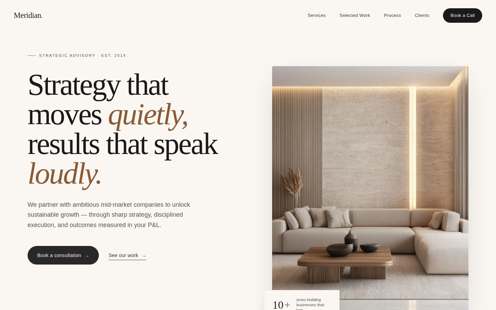
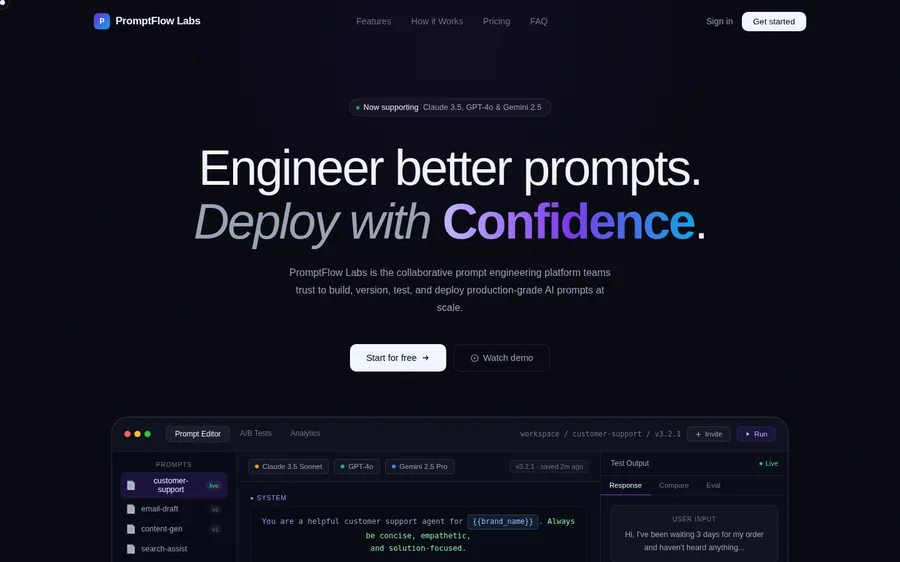
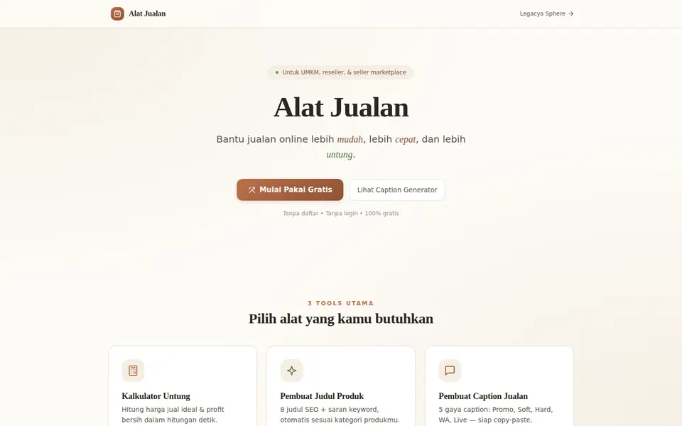

<div align="center">

<br />


<br /><br />

# Legacya Sphere

### Premium Creative Web Studio

*Refined websites. Intelligent automations. Selective engagements.*

<br />

[](https://legacyasphere.com)
[](https://developer.mozilla.org/en-US/docs/Web/HTML)
[](https://tailwindcss.com)
[](https://developer.mozilla.org/en-US/docs/Web/JavaScript)
[](https://anthropic.com)
[](LICENSE)

<br />

</div>

---

## What Is This?

**Legacya Sphere** is a production-grade portfolio-as-product — a zero-dependency static website that serves as both a client-facing studio identity and a live engineering case study. No React. No npm. No build step. Just disciplined HTML, Tailwind CSS, and composable vanilla JavaScript shipped as a single deployable file.

> *"Most portfolios show what you've built. This one shows how you think."*

This repository is a **public architecture study** in performance-first frontend engineering: sophisticated UX patterns (scroll-driven 3D transforms, IntersectionObserver reveal chains, cross-fade slideshows), product thinking (availability scarcity, honeypot spam protection, bilingual UX), and startup-quality visual design — delivered with zero framework overhead.

---

## Product Goals

| Goal | How It's Achieved |
|------|-------------------|
| First impression in **< 3s** | Critical CSS inlined, splash screen blocks FOUC entirely |
| **Zero Cumulative Layout Shift** | Font preloads + skeleton-aware rendering |
| **Mobile-first** | Tailwind responsive utilities, touch-optimized interactions |
| **Accessible** | ARIA labels, keyboard navigation, `prefers-reduced-motion` |
| **Privacy-first contact** | `mailto:` protocol — no backend, no CORS, no data stored |
| **Selective brand positioning** | Availability indicator, "consultation by application" UX pattern |

---

## Features

### User Experience
- **Branded splash screen** — eliminates flash of unstyled content, 4-second JS failsafe
- **Scroll-reveal system** — `IntersectionObserver`-powered entrance animations on 15+ sections
- **3D brand flip card** — scroll-position driven via `requestAnimationFrame` (not CSS-only, for broader browser support)
- **Project slideshow** — auto-cycles on hover, manual dot navigation, cross-fade transitions
- **Infinite marquee** — smooth tech stack ticker, GPU-accelerated
- **Dynamic navbar** — border-color transitions on scroll, mobile drawer with Escape-key dismiss

### Product Sections
- **Hero** — asymmetric layout with orbital SVG decorations, bilingual CTA
- **Services** — 3 tiers (Landing Pages · Website Development · AI Automation) with transparent pricing
- **Manifesto** — 6 core principles in a dark editorial layout
- **Sphere Protocol** — 5-step process timeline for client engagements
- **Work showcase** — Featured case study (Meridian Advisory) + 2 secondary projects
- **Contact form** — Honeypot-protected inquiry form with pre-filled `mailto:` template

### Engineering Quality
- **Browser compatibility detector** — toast notification for non-Chrome users with one-tap copy-link
- **Honeypot spam protection** — hidden field traps bots at form submission, zero user friction
- **SEO-complete** — Open Graph, Twitter Cards, canonical URL, keyword meta
- **Bilingual** — Full English / Bahasa Indonesia support throughout

---

## Tech Stack

```
┌─────────────────────────────────────────────────────────────┐
│                      LEGACYA SPHERE                         │
│                                                             │
│  Structure     HTML5 (semantic, ARIA-complete)              │
│  Styling       Tailwind CSS v3 (CDN, custom design tokens)  │
│  Logic         Vanilla JavaScript (zero dependencies)       │
│  Typography    Fraunces · Instrument Serif · Inter          │
│                JetBrains Mono                               │
│  Images        WebP (optimized) · PNG (hi-resolution)       │
│  Deployment    Static — deploy anywhere in 30 seconds       │
└─────────────────────────────────────────────────────────────┘
```

**Why no framework?**

A content-driven studio site has no state management problem to solve. Introducing React or Vue would add:
- 200KB+ JS parse budget
- A build toolchain to maintain
- Dependency vulnerabilities to patch
- Longer deploy cycles

The tradeoff is disciplined, composable vanilla JS — a constraint that sharpens the code.

---

## Screenshots

<br />

**Hero — Asymmetric layout with orbital decorations**


<br />

**Featured Work — Meridian Advisory Case Study**



<br />

**Project: Legacya POS UI**



<br />

**Project: Hybrid Dashboard**



---

## Live Demo

| Environment | URL | Notes |
|-------------|-----|-------|
| **Production** | [legacyasphere.com](https://legacyasphere.com) | Primary domain |
| **GitHub Pages** | [legacyasphere-id.github.io/Legacya-Portofolio](https://legacyasphere-id.github.io/Legacya-Portofolio) | Mirror |

> Best experienced in **Google Chrome** on desktop for full animation fidelity. The browser detector will surface a recommendation tip on other browsers.

---

## Getting Started

### Run Locally

```bash
# 1. Clone the repository
git clone https://github.com/legacyasphere-id/Legacya-Portofolio.git
cd Legacya-Portofolio

# 2a. Python (available everywhere, zero install)
python3 -m http.server 8080

# 2b. Node.js
npx serve .

# 2c. VS Code
# Install "Live Server" extension → right-click index.html → "Open with Live Server"
```

Open `http://localhost:8080` in Chrome.

> **Note:** Opening `index.html` as a `file://` URL works but may restrict font loading on some browsers. A local server gives the full experience.

### Customize

All design tokens live in the Tailwind config block at the top of `index.html`:

```javascript
window.tailwind.config = {
  theme: {
    extend: {
      colors: {
        bg:   "#F7F4ED",  // page background
        gold: "#B8956A",  // accent color — change this to retheme
        ink:  "#1C1A17",  // text color
      }
    }
  }
}
```

Swap the color values to retheme the entire site instantly.

---

## Folder Structure

```
Legacya-Portofolio/
│
├── index.html          # Entire application — markup, styles, and logic
│
├── img-15.webp         # Legacya Sphere logo mark
├── img-04.webp         # Founder portrait
├── img-05.webp         # Anthropic Claude 101 certification
│
├── img-06.webp         # Legacya POS UI — screenshot 1
├── img-07.webp         # Legacya POS UI — screenshot 2
├── img-08.webp         # Legacya POS UI — screenshot 3
│
├── img-09.webp         # Hybrid Dashboard — screenshot 1
├── img-10.webp         # Hybrid Dashboard — screenshot 2
├── img-11.webp         # Hybrid Dashboard — screenshot 3
│
├── img-12.png          # Meridian Advisory — hero shot (hi-res)
├── img-13.png          # Meridian Advisory — detail view 1
└── img-14.png          # Meridian Advisory — detail view 2
```

---

## Architecture

### v1 — Zero-Dependency Static (Current)

```
Browser Request
  └── index.html
        ├── <style> Critical CSS ──── locks layout, prevents FOUC
        ├── Tailwind CDN ──────────── utility classes via JIT
        ├── Google Fonts ──────────── Fraunces, Inter, JetBrains Mono
        └── <script> Vanilla JS
              ├── SplashController       — branded loading overlay
              ├── RevealObserver         — IntersectionObserver chain
              ├── ScrollTracker          — rAF-based position tracking
              ├── CardFlipController     — 3D transform on scroll
              ├── SlideshowEngine        — project image carousel
              ├── MobileMenuController   — drawer + keyboard support
              ├── FormHandler            — mailto + honeypot validation
              └── BrowserDetector        — Chrome recommendation toast
```

**Performance profile:** < 100KB HTML, < 10KB JS, images lazy-loaded with WebP.

### v2 — Component-Based (Planned)

As the site grows toward a CMS-driven studio platform, the architecture evolves:

```
src/
├── components/
│   ├── Hero/
│   ├── Services/
│   ├── Projects/
│   └── Contact/
├── styles/
│   └── tokens.css
├── scripts/
│   ├── animations.js
│   ├── slideshow.js
│   └── form.js
└── build.js            # concat + minify, no bundler needed
```

---

## Engineering Decisions

| Decision | Rationale |
|----------|-----------|
| **No React / Vue / Svelte** | Content-driven site — framework overhead outweighs benefits |
| **Tailwind via CDN** | Zero build toolchain; tradeoff: 100KB CDN vs 0-second setup |
| **`mailto:` contact form** | Privacy-first: no backend attack surface, no CORS, works offline |
| **WebP image format** | 60–80% smaller than equivalent PNG/JPG |
| **Inline critical CSS** | Eliminates render-blocking stylesheets, guarantees 0 FOUC |
| **`requestAnimationFrame` card flip** | Smooth 60fps; CSS `scroll-driven` has limited browser support |
| **Honeypot spam protection** | Zero friction for real users, no CAPTCHA, stops naive bots |
| **Bilingual copy** | Targets both global (EN) and local (ID) markets simultaneously |

---

## Roadmap

### Phase 1 — Foundation ✅ Complete
- [x] Production splash screen with failsafe
- [x] Full SEO (Open Graph, Twitter Cards, canonical)
- [x] Accessibility (ARIA, keyboard nav, reduced-motion)
- [x] Mobile-responsive layout
- [x] Browser compatibility detection
- [x] Honeypot spam protection

### Phase 2 — Performance
- [ ] Self-host fonts (remove Google Fonts dependency)
- [ ] Convert PNG assets to WebP
- [ ] Add Service Worker for offline support
- [ ] Hit 100/100 Lighthouse across all categories

### Phase 3 — Product Evolution
- [ ] Dark mode with `localStorage` persistence
- [ ] CMS integration (Notion API or Contentlayer)
- [ ] Privacy-first analytics (Plausible)
- [ ] Expanded case studies / blog

### Phase 4 — SaaS Features
- [ ] AI-powered project brief generator (Claude API)
- [ ] Interactive pricing calculator
- [ ] Booking system (Cal.com embed)
- [ ] Client portal with protected content
- [ ] Multi-language auto-detection (`navigator.language`)

---

## Deployment

### Recommended: Vercel (30-second deploy)

```bash
npm i -g vercel
vercel --prod
```

Then in the Vercel dashboard: **Settings → Domains → Add** `legacyasphere.com`.

### Cloudflare Pages (Maximum CDN performance)

```bash
npx wrangler pages deploy . --project-name legacya-sphere
```

Or connect the GitHub repo in the Cloudflare dashboard — build command: *(none)*, output directory: `/`.

### Netlify

```bash
# Drag-and-drop the project folder at app.netlify.com/drop
# Or via CLI:
npx netlify-cli deploy --prod --dir .
```

### GitHub Pages (Mirror / Backup)

Enable in **Settings → Pages → Deploy from branch → `main` → `/ (root)`**.

### Platform Comparison

| Platform | Speed | Free Domain | Analytics | Best For |
|----------|-------|-------------|-----------|----------|
| **Vercel** | ⚡ Fast | ✅ | ✅ Built-in | Primary — easiest setup |
| **Cloudflare Pages** | ⚡⚡ Global | ✅ | ✅ | Maximum performance |
| **Netlify** | ⚡ Fast | ✅ | ✅ | Forms & serverless |
| **GitHub Pages** | Standard | ✅ | ❌ | Mirror/backup only |

> Deploy to Vercel or Cloudflare Pages first. A live link in every job application is 10× more effective than a GitHub repo URL alone.

---

## Performance Targets

| Metric | Target | Strategy |
|--------|--------|----------|
| Performance | 90+ | WebP + lazy loading + no render-blocking JS |
| Accessibility | 95+ | ARIA labels + semantic HTML |
| Best Practices | 95+ | HTTPS + no console errors |
| SEO | 100 | Complete meta tag coverage |

---

## Author

<br />

**Yoga Pratama Effendi**
Founder · Legacya Sphere
Bekasi, West Java, Indonesia

*AI-native fullstack developer. Anthropic Claude 101 certified. Building refined digital products for thoughtful brands.*

[](https://legacyasphere.com)
[](https://github.com/legacyasphere-id)
[](mailto:hello@legacyasphere.com)

---

## License

[MIT](LICENSE) — Code is open for inspiration. Brand, copy, and client work belong to Legacya Sphere.

---

<div align="center">

*Quality over volume. Craft over speed.*

**[View Live Site](https://legacyasphere.com) · [Report a Bug](https://github.com/legacyasphere-id/Legacya-Portofolio/issues/new?template=bug_report.yml) · [Request a Feature](https://github.com/legacyasphere-id/Legacya-Portofolio/issues/new?template=feature_request.yml)**

</div>
