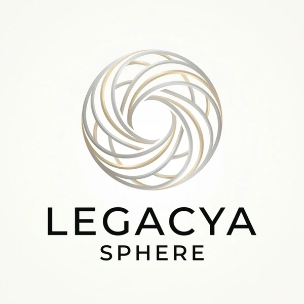

<div align="center">

<br />



<br /><br />

# Legacya Sphere — Portfolio

### React + Vite + TypeScript · An Operating Systems Studio's front door

*Not a marketing page. A system.*

<br />

[](https://legacya-portofolio.vercel.app)
[](https://legacyasphere-id.github.io/Legacya-Portofolio/)
[](https://react.dev)
[](https://www.typescriptlang.org)
[](https://vitejs.dev)

<br />

</div>

---

## What is this?

The portfolio site for **Legacya Sphere**, an AI-native business systems studio. It's a production React application: every section reads from a typed data layer, the brand artwork is used directly as the page background, and typography — not decoration — carries the design.

---

## Tech stack

| Layer | Technology |
|-------|------------|
| Framework | React 18 (StrictMode) |
| Language | TypeScript 5 (strict, `noUnusedLocals`) |
| Build | Vite 5 (ESM, tree-shaking, content hashing) |
| Styling | Tailwind CSS v3 (custom cream/blue tokens) |
| Typography | Sora (display) · Inter (sans) · Geist Mono (mono) |
| Images | WebP (lazy-loaded, `BASE_URL`-safe) |
| Testing | Playwright (`tests/portfolio.spec.ts`) |
| Deployment | Vercel (primary) · GitHub Pages (mirror) |

---

## Design system

A calm cream canvas with a single blue accent — restraint over decoration. Tokens live in `tailwind.config.js`.

| Token | Value | Use |
|-------|-------|-----|
| `bg` | `#F5F0E8` | Page canvas |
| `surface` | `#FAF7F2` | Cards, elevated content |
| `raised` | `#F0EADF` | Subtle elevation |
| `border` | `#E5DDD0` | Dividers, cards, inputs |
| `text` | `#181818` | Headlines & primary content |
| `muted` | `#66625D` | Supporting copy |
| `dim` | `#9A958C` | Metadata, faint labels |
| `blue` | `#5E7EBE` | Primary accent — highlights, links |
| `blue-deep` | `#2F4F7F` | Authority — buttons, key actions |
| `blue-dark` | `#26416B` | Hover for deep blue |

---

## Page sections

Composed in order by `src/App.tsx`:

| # | Section | Description |
|---|---------|-------------|
| — | **Nav** (`SiteNav`) | Minimal navigation floating over the artwork; the Pricing item has a cursor-following glow |
| 1 | **Hero** | Large display headline, supporting paragraph, three floating frosted cards |
| 2 | **Tech Stack** | Two-row logo marquee (stack + AI models) |
| 3 | **Systems** | What the studio builds, with custom illustrated icons |
| 4 | **Work** | Case studies with problem → solution → outcome breakdowns |
| 5 | **Proof** | Dark metrics band + trusted-by line (testimonial-ready) |
| 6 | **Process** | How engagements run |
| 7 | **Philosophy** | "Systems over software" |
| 8 | **Founder** | Who's behind Legacya Sphere — portrait, bio, links |
| 9 | **Pricing** | Three service tiers with spotlight, hover, and gradient-border interactions |
| 10 | **CTA** | Start-a-project call to action |
| — | **Footer** | Nav columns, wordmark, availability |

---

## Project structure

```
Legacya-Portofolio/
├── public/                       # Static assets (served at BASE_URL)
│   ├── img-04.webp               # Founder portrait
│   ├── img-15.webp               # Legacya Sphere logo
│   ├── img-16..23.webp           # Project screenshots (InventoryOS, AI-CV, BrightPath, POS)
│   ├── logos/                    # Tech-stack marquee brand logos (SVG)
│   ├── icons/                    # Custom feature-card icons (PNG)
│   ├── logo.png                  # Nav / footer / splash mark
│   └── assets/certificates/      # PDF certificates
│
├── src/
│   ├── core/
│   │   └── identity.ts           # Single source of truth for name, links, copy
│   ├── data/
│   │   └── projects.ts           # Case studies with full breakdowns
│   ├── types/
│   │   └── project.ts            # Shared TypeScript interfaces
│   ├── utils/
│   │   └── asset.ts              # BASE_URL-aware image path helper
│   ├── hooks/
│   │   └── useScrollReveal.ts    # IntersectionObserver fade/rise reveal
│   ├── components/               # SiteNav, SectionGuide, Footer
│   ├── sections/                 # One file per page section
│   ├── assets/
│   │   └── hero-background.webp  # Brand artwork (fixed page background)
│   ├── App.tsx                   # Root — composes all sections
│   ├── main.tsx                  # React 18 createRoot entry
│   └── index.css                 # Tailwind directives + base styles
│
├── index.html                    # Vite entry — splash screen, fonts
├── vite.config.ts                # Dual base: '/' (Vercel) or '/Legacya-Portofolio/' (Pages)
├── tailwind.config.js            # Cream/blue tokens + font families
├── playwright.config.ts          # E2E config
├── tests/portfolio.spec.ts       # Smoke tests (nav, sections, links)
├── vercel.json                   # SPA rewrites
└── .github/workflows/deploy.yml  # Validate → build → deploy to GitHub Pages
```

---

## Architecture notes

### The artwork is the background

The brand artwork (`src/assets/hero-background.webp`) is applied once as a fixed, full-viewport background in `index.css` (`body::before`), with an optional ≤10% white overlay for contrast. There are no CSS-generated gradients, rings, or decorative graphics — content simply floats over the single image as you scroll.

### `BASE_URL`-aware assets

Images in `public/` are referenced through `src/utils/asset.ts` so paths resolve on both hosts:

```typescript
export const asset = (path: string): string =>
  `${import.meta.env.BASE_URL}${path.replace(/^\//, '')}`
```

`asset('img-04.webp')` → `/img-04.webp` on Vercel, `/Legacya-Portofolio/img-04.webp` on GitHub Pages.

### Dual-target base URL

```typescript
// vite.config.ts
base: process.env.VERCEL ? '/' : '/Legacya-Portofolio/',
```

Vercel sets `VERCEL=1` automatically; GitHub Actions does not — so both targets get the correct prefix with no extra config.

### Splash screen

`index.html` renders an inline-CSS splash before JS loads; React removes it via `useEffect` on first render, with a 30-second fallback that clears it if JS never boots.

### Scroll reveal

`useScrollReveal` wires an `IntersectionObserver` to every `[data-animate]` element for a subtle fade + 8px rise. It honors `prefers-reduced-motion`.

---

## Getting started

```bash
git clone https://github.com/legacyasphere-id/Legacya-Portofolio.git
cd Legacya-Portofolio

npm install        # install dependencies
npm run dev        # dev server (hot reload) → http://localhost:5173
npm run build      # type-check + production build
npm run preview    # preview the production build locally
```

---

## Deployment

### Vercel (primary — auto-deploy on push to `main`)

Build command `npm run build`, output directory `dist`. Every push to `main` deploys.

### GitHub Pages (mirror — auto-deploy via Actions)

`.github/workflows/deploy.yml` runs on every push to `main`: validates source, runs `npm ci && npm run build`, and publishes `dist/` as a Pages artifact.

| Environment | URL |
|-------------|-----|
| **Vercel (primary)** | [legacya-portofolio.vercel.app](https://legacya-portofolio.vercel.app) |
| **GitHub Pages (mirror)** | [legacyasphere-id.github.io/Legacya-Portofolio](https://legacyasphere-id.github.io/Legacya-Portofolio/) |

---

## Author

**Yoga Pratama Effendi**
Founder · Legacya Sphere · Bekasi, Indonesia · GMT+7

[](https://github.com/legacyasphere-id)
[](mailto:legacyasphere@gmail.com)
[](https://www.linkedin.com/in/yoga-pratamaeffendi-59b376245)

---

## License

[MIT](LICENSE) — code is open for inspiration. Brand, copy, and client work belong to Legacya Sphere.
